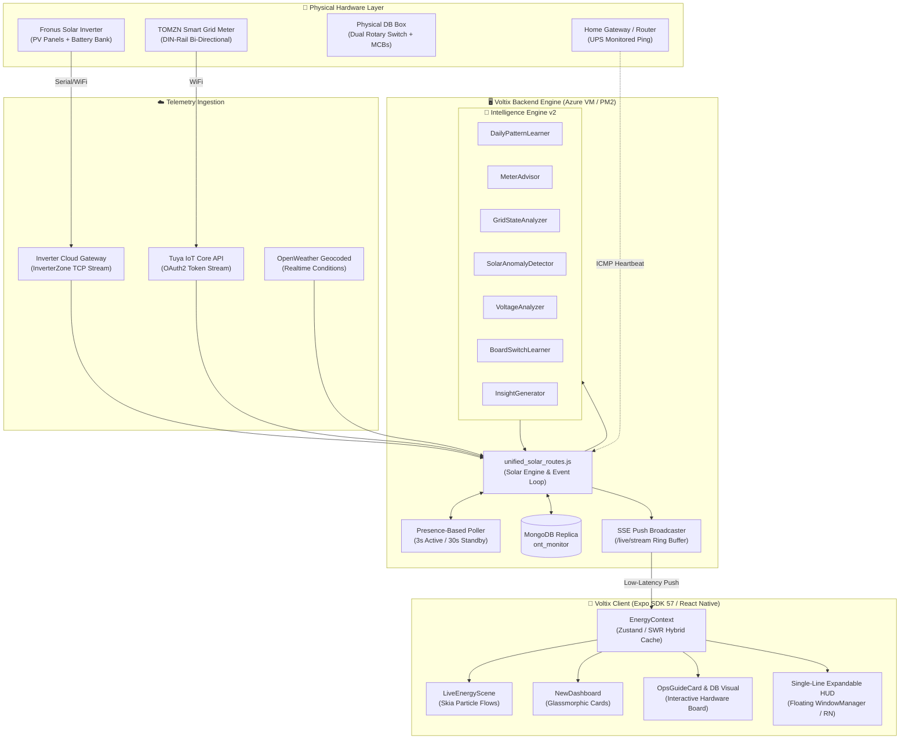

<div align="center">

<!-- Hero Banner -->


<!-- Typing Slogan -->
<a href="https://github.com/your-username/voltix">
  
</a>

<br/>

<!-- Shields & Badges -->
<p>
  
  
  
  
  
  
</p>

<p>
  
  
  
  
  
</p>

<br/>

> **Voltix** is an autonomous residential energy intelligence and telemetry platform designed for hybrid solar ecosystems. It fuses solar inverter telemetry, grid-side IoT smart metering, dual utility tariff structures, physical distribution board state machine modeling, and machine learning into an instant glanceable interface — featuring a **Single-Line Expandable Floating HUD**, **Physical DB Board Visualizer**, and an **Adaptive Meter Quota Advisor**.

<br/>

<a href="#quick-navigation">
  
</a>

</div>

---

<a name="quick-navigation"></a>
## 🧭 Table of Contents

- [The Core Problem](#-the-core-problem)
- [System Architecture](#-system-architecture)
- [Key Innovations & Features](#-key-innovations--features)
  - [1. Single-Line Expandable Floating Overlay HUD](#1-single-line-expandable-floating-overlay-hud)
  - [2. Live Energy Scene & Ambient Themes](#2-live-energy-scene--ambient-themes)
  - [3. Interactive Operations Guide & DB Board Visualizer](#3-interactive-operations-guide--db-board-visualizer)
  - [4. Dual-Meter Allocation & Protected Quota Ledger](#4-dual-meter-allocation--protected-quota-ledger)
- [Energy Intelligence Engine v2](#-energy-intelligence-engine-v2)
- [Physical Hardware & Telemetry Pipeline](#-physical-hardware--telemetry-pipeline)
- [Presence-Based Polling & Realtime Streaming](#-presence-based-polling--realtime-streaming)
- [Failover & Offline Anomaly Detection](#-failover--offline-anomaly-detection)
- [API Reference](#-api-reference)
- [Tech Stack](#-tech-stack)
- [Project Directory Structure](#-project-directory-structure)
- [Getting Started & Deployment](#-getting-started--deployment)
- [License](#-license)

---

## ⚡ The Core Problem

Modern hybrid solar households face a complex, fragmented reality:
1. **Asymmetric Data Streams**: Solar inverters report AC load and PV production, but cannot measure actual bi-directional grid exchange with transmission line losses.
2. **Dual-Meter Quota Slabs**: Utility billing (e.g., WAPDA) enforces tiered pricing slabs. Exceeding a slab threshold causes punitive tariff jumps across the entire bill. Managing two separate physical meters requires precise timing on which meter to run and when to switch.
3. **Physical Breaker Confusion**: Switching meters or isolating faults requires physically interacting with a multi-breaker Distribution Board (DB). Incorrect breaker sequences can cause dangerous backfeeding or unexpected cutoffs.
4. **App Friction**: Opening a heavy mobile app every time you want to check if you're exporting or importing creates friction.

**Voltix solves this holistically:**
- **Single Source of Truth**: TOMZN IoT smart meter hardware cumulative kWh forms an immutable allocation ledger.
- **Physical State Modeling**: Real-time inference of physical breaker positions, rotary switches, and trip states.
- **Micro-Footprint Floating HUD**: An ultra-sleek, single-line dynamic capsule that floats over any Android app or game without obstructing navigation.

---

## 🏗️ System Architecture

Voltix operates across four tightly synchronized tiers: **Hardware Layer**, **Cloud Ingestion**, **Edge Intelligence Engine**, and the **Mobile Client**.



---

## 💎 Key Innovations & Features

### 1. Single-Line Expandable Floating Overlay HUD

The floating HUD solves ambient energy glanceability. It operates as an Android native foreground service (`FloatingOverlayService.kt`) and an in-app interactive clone (`DevOverlayPreview.tsx`).

<div align="center">

```
  ┌───────────────────────────────────────────────────────────┐
  │  COMPACT MODE (DEFAULT)                                   │
  │  Ultra-low profile • Only 26px high • Width ~64px         │
  │                                                           │
  │    ┌────────────────────┐       ┌────────────────────┐    │
  │    │  ⚡  2.90kW   ↑    │  vs   │  ⚡  0.60kW   ↓    │    │
  │    └────────────────────┘       └────────────────────┘    │
  │       (Solar Export)               (Grid Import)          │
  │       Sky-Blue Unified              Coral-Red Unified     │
  └───────────────────────────────────────────────────────────┘
                                ▲
                          TAP TO BLOOM
                                ▼
  ┌───────────────────────────────────────────────────────────┐
  │  EXPANDED MODE (SINGLE-LINE FULL HUD)                     │
  │  Height locked at 26px • Single horizontal row • Zero clutter│
  │                                                           │
  │    ┌──────────────────────────────────────────────────┐   │
  │    │  ☀️ 3.80kW   │   🏠 0.82kW   │   ⚡ 2.90kW  ↑    │   │
  │    └──────────────────────────────────────────────────┘   │
  │       (Solar PV)       (Home Load)    (Grid Exchange)     │
  └───────────────────────────────────────────────────────────┘
```

</div>

- **Compact State (Default)**:
  - Measures only **64px wide × 26px high**.
  - Shows **only the WAPDA grid exchange** — the exact metric that matters when browsing or gaming.
  - **Grid Import**: Entire node is unified in **Red (`#EF4444`)** — downward chevron `↓`, power value, `kW` unit, and zap icon, with a subtle ambient red border aura.
  - **Solar Export**: Entire node is unified in **Sky Blue (`#38BDF8`)** — upward chevron `↑`, power value, `kW` unit, and zap icon, with a subtle blue border aura.
  - **Idle / Blackout**: Muted slate (`#94A3B8`) or animated amber pill for UPS backup.
- **Expanded State (Tap on Pill)**:
  - Smoothly expands **horizontally on the exact same single line** (height stays at 26px).
  - Unfolds Solar (`☀️ 3.80kW` amber) and Home (`🏠 0.82kW` emerald) with micro-hairline dividers.
  - Tapping again smoothly collapses it back to the compact grid pill.
- **Smart Minimal Power Formatting Rules**:
  - **Under 1000W (`watts < 1000`)**: Formats as whole integer Watts (`4W`, `10W`, `999W`, `0W`).
  - **1000W and above (`watts >= 1000`)**: Formats in kW with up to 2 decimal places, automatically stripping redundant trailing zeros (`1kW`, `1.05kW`, `1.1kW`, `1.9kW`, `1.94kW`).

---

### 2. Live Energy Scene & Ambient Themes

The Hero component (`LiveEnergyScene.tsx`) renders dynamic electricity flows between Solar, Inverter, Battery, Home, and Grid:
- **Particle Dynamics**: Real-time rendering of energetic electrons whose speed and particle density directly correlate to instantaneous wattage.
- **Weather-Adaptive Environment**: Automatically transitions between daylight sunshine, cloudy overcast, storm rain, and night scenes based on local solar altitude and weather telemetry.
- **Hero Wire Tuner**: Built-in developer editor (`overlay-editor.tsx`) to visually drag, position, and calibrate SVG anchor points per scene.

---

### 3. Interactive Operations Guide & DB Board Visualizer

Voltix features a hardware distribution board simulator (`OpsBoardVisual.tsx`) matching real electrical panels:
- **Physical Element Modeling**: Dual changeover rotary levers, individual MCB switches for solar, grid, and home sub-circuits, and smart trip flags.
- **Automated State Inference (`ops-board-infer.ts`)**: Cross-references live TOMZN voltage and inverter telemetry to infer physical switch positions.
- **Guided Workflows (`ops-workflows.ts`)**: Interactive step-by-step instructions for safely performing meter changeovers, bypass activations, and trip recovery with safety confirmations.

---

### 4. Dual-Meter Allocation & Protected Quota Ledger

For households with two physical meters (e.g. sharing peak/off-peak allocations or dual consumer IDs):
- **Cumulative Hardware Truth**: TOMZN's cumulative counter is treated as an append-only ledger. Delta increments are recorded once and assigned to the currently active meter ID.
- **Protected Reserve Math**:
  - **Meter 1**: 2.0 kWh protected emergency reserve.
  - **Meter 2**: 0.0 kWh buffer.
- **Slab Expiry Timing**: Predicts the exact hour each tariff bracket will expire based on learned household burn rates, recommending safe changeover windows before penalization occurs.

---

## 🧠 Energy Intelligence Engine v2

Operating within `backend/intelligence/`, the engine runs on every telemetry snapshot to produce contextual household guidance:

```
┌────────────────────────────────────────────────────────────────────────┐
│                   ENERGY INTELLIGENCE ENGINE v2                        │
├──────────────────┬─────────────────────────────────────────────────────┤
│ Module           │ Core Analytical Responsibility                      │
├──────────────────┼─────────────────────────────────────────────────────┤
│ DailyPattern     │ 14-day profile: weekday vs weekend baseline curves, │
│ Learner          │ hourly export windows, mode-specific consumption.   │
├──────────────────┼─────────────────────────────────────────────────────┤
│ MeterAdvisor     │ Quota exhaustion forecasting, slab timing advice,   │
│                  │ 15-minute switch hysteresis to prevent flip-flopping│
├──────────────────┼─────────────────────────────────────────────────────┤
│ GridState        │ Fuses TOMZN + Inverter data into 5 discrete states: │
│ Analyzer         │ CUTOFF, BROWN_OUT, UNSTABLE, RESTORED, INVERTER_OFF │
├──────────────────┼─────────────────────────────────────────────────────┤
│ SolarAnomaly     │ Detects cloud dips, soiled panels, string faults,   │
│ Detector         │ and compares output to expected astronomical curve. │
├──────────────────┼─────────────────────────────────────────────────────┤
│ VoltageAnalyzer  │ Brownout detection, grid overvoltage, inverter AC   │
│                  │ output phase consistency checks.                    │
├──────────────────┼─────────────────────────────────────────────────────┤
│ ExportAnalyzer   │ Missed-export detection (high solar + importing),   │
│                  │ optimal appliance load-shifting advisories.         │
├──────────────────┼─────────────────────────────────────────────────────┤
│ BoardSwitch      │ Tracks physical changeovers and correlates manual   │
│ Learner          │ breaker actions with downstream sensor shifts.      │
├──────────────────┼─────────────────────────────────────────────────────┤
│ ConfidenceEngine │ Computes sensor trustworthiness scores (0.0 - 1.0)   │
│                  │ based on latency, jitter, and drift.                │
├──────────────────┼─────────────────────────────────────────────────────┤
│ InsightGenerator │ Synthesizes raw metrics into natural, executive     │
│                  │ guidance: "Number + Context + Action + Impact".     │
└──────────────────┴─────────────────────────────────────────────────────┘
```

---

## 📡 Physical Hardware & Telemetry Pipeline

```
┌─────────────────┐       ┌─────────────────┐       ┌─────────────────┐
│  SOLAR PANELS   │       │   WAPDA GRID    │       │  BATTERY BANK   │
│  (PV Strings)   │       │ (Dual Feeders)  │       │  (48V Lithium)  │
└────────┬────────┘       └────────┬────────┘       └────────┬────────┘
         │                         │                         │
         ▼                         ▼                         ▼
┌─────────────────┐       ┌─────────────────┐       ┌─────────────────┐
│ Fronus Inverter │       │   TOMZN Meter   │       │   Inverter DC   │
│ (InverterZone)  │       │ (Tuya IoT Core) │       │  BMS Telemetry  │
└────────┬────────┘       └────────┬────────┘       └────────┬────────┘
         │                         │                         │
         └────────────────┐        │        ┌────────────────┘
                          ▼        ▼        ▼
                   ┌───────────────────────────────┐
                   │   Voltix Fusion Controller    │
                   │    (unified_solar_routes)     │
                   └───────────────────────────────┘
```

- **Inverter**: Cloud polled via InverterZone REST gateway; direct TCP socket ping fallback for instant offline detection.
- **Smart Meter**: Bi-directional high-precision energy meter on Tuya IoT Core; measures real instantaneous grid exchange, active power, voltage, and frequency.
- **UPS Heartbeat**: Periodic ICMP echo to home gateway verifying whether home networking is powered via battery backup during utility outages.

---

## ⚡ Presence-Based Polling & Realtime Streaming

To minimize API quotas, power draw, and cloud costs while keeping latency near zero:

| Client State | Polling Cadence | Ingestion Strategy | Bandwidth |
|---|---|---|---|
| **App Active / HUD Open** | **3 seconds** | Live Inverter + TOMZN Poll | ~200 bytes (SSE push on delta) |
| **App Backgrounded / Idle** | **30 seconds** | Low-frequency background poll | Zero SSE broadcast |
| **Delta Sync** | **30s interval** | `?since=<dataVersion>` | 551 B (unchanged) vs 50 KB (full) |

- **Instant Cold Starts**: Restores telemetry from local cache in **< 50ms**, then hydrates via `/api/solar/live` without waiting for long cloud round-trips.
- **Deduplication Ring Buffer**: Backend fingerprints data payloads (`solarW|homeW|gridW|batterySOC`); only broadcasts SSE events when values actually shift.

---

## 🛡️ Failover & Offline Anomaly Detection

Voltix implements defensive multi-layer validation to eliminate false positives:

1. **TOMZN Stale Fingerprint Detection**:
   - Computes `energyKwh|powerW|voltageV|currentA`.
   - 10 consecutive identical readings marks device as stale (`isOnline: false`).
   - Zero energy counter (`energyKwh == 0`) is treated as corrupt telemetry and rejected; recovers last known positive value from DB.
2. **Inverter TCP Fallback**:
   - When cloud API reports identical numbers, backend initiates a direct TCP socket check to the inverter's public IP port.
   - If TCP ping fails, marks inverter offline immediately (bypassing the standard 4-retry counter).
3. **Blackout Differentiation**:
   - Inverter Offline + TOMZN Offline + UPS Ping Alive = **Router running on UPS, solar down**.
   - Inverter Offline + TOMZN Offline + UPS Ping Dead = **Total household power blackout**.

---

## 🔌 API Reference

### Core Endpoints (`backend/unified_solar_routes.js`)

```
GET    /api/solar/live                  # Lightweight live snapshot (inverter + tomzn)
GET    /api/solar/live/stream           # Server-Sent Events (SSE) live push stream
GET    /api/solar/dashboard             # Full dashboard state with meters & forecasts
GET    /api/solar/dashboard/sync?since  # Delta sync (returns { changed: false } if current)
GET    /api/solar/flow-history          # 24-hour historical power flow chart data
GET    /api/solar/perf                  # Real-time backend performance metrics (60s rolling)

POST   /api/solar/refresh               # Force-refresh all devices & clear cache
POST   /api/solar/refresh/tomzn         # Force-refresh TOMZN meter only
POST   /api/solar/refresh/inverter      # Force-refresh Inverter only
POST   /api/solar/changeover            # Register a meter changeover event
POST   /api/solar/manual-readings       # Submit a physical utility meter reading
PATCH  /api/solar/manual-readings/:id   # Edit a historical manual meter reading
DELETE /api/solar/manual-readings/:id   # Remove a manual meter reading
POST   /api/solar/baselines             # Set/update baseline calibration for meters
```

---

## 💻 Tech Stack

<div align="center">

| Domain | Technologies |
|---|---|
| **Mobile Core** | React Native 0.86, Expo SDK 57, React 19, TypeScript 6.0 |
| **State & Navigation** | Expo Router (file-based), React Context, AsyncStorage |
| **UI & Graphics** | React Native Skia, Reanimated 4, Lucide Icons, Expo Blur, Moti |
| **Native Extensions**| Android Foreground Services (Kotlin), WindowManager Overlays |
| **Backend Runtime** | Node.js 20 LTS, Express, Server-Sent Events (SSE) |
| **Data & Storage** | MongoDB (Replica Set), Mongoose, In-Memory Ring Buffer |
| **IoT & APIs** | Tuya Cloud API, InverterZone Protocol, OpenWeather OneCall |
| **DevOps & Process** | PM2 Process Manager, Gradle 8, Android WiFi ADB, Azure VM |

</div>

---

## 📂 Project Directory Structure

```
voltix/
├── src/
│   ├── app/                         # Expo Router navigation tree
│   │   ├── (tabs)/                  # Tabs: Dashboard, Meters, History, Logs, Settings
│   │   ├── overlay-editor.tsx       # Interactive SVG wire calibrator
│   │   └── _layout.tsx              # Root app layout & theme provider
│   ├── components/                  # UI component library
│   │   ├── DevOverlayPreview.tsx    # Single-Line Expandable HUD (RN in-app)
│   │   ├── LiveEnergyScene.tsx      # Skia-powered hero energy flow canvas
│   │   ├── NewDashboard.tsx         # Responsive dashboard container
│   │   ├── OpsBoardVisual.tsx       # Hardware DB box breaker visualizer
│   │   ├── OpsGuideCard.tsx         # Guided switch workflow sheet
│   │   └── EnergyIntelligenceCard.tsx# Household AI advisory card
│   ├── context/                     # Application state
│   │   ├── EnergyContext.tsx        # Central telemetry stream & delta synchronizer
│   │   └── SceneThemeContext.tsx    # Weather & lighting theme engine
│   ├── native/                      # Native Kotlin bridge interfaces
│   │   └── FloatingOverlay.ts       # Android system alert window controller
│   └── utils/                       # Algorithmic utilities
│       ├── ops-board-infer.ts       # Physical breaker state inference
│       └── offline-dashboard.ts     # Daily pattern estimation
├── backend/
│   ├── backend_api.js               # Express server bootstrap & routing
│   ├── unified_solar_routes.js      # Solar Engine, SSE broadcasting, meter allocation
│   ├── tuya_routes.js               # Tuya smart meter gateway
│   └── intelligence/                # Intelligence Engine v2 modules
│       ├── DailyPatternLearner.js   # 14-day load & export profiles
│       ├── MeterAdvisor.js          # Quota timing & slab advisor
│       ├── GridStateAnalyzer.js     # Bi-directional grid state machine
│       ├── SolarAnomalyDetector.js  # Solar production fault detector
│       ├── BoardSwitchLearner.js    # Breaker switch telemetry correlation
│       └── InsightGenerator.js      # Natural language synthesis
├── android/                         # Android native source
│   └── app/src/main/java/com/voltix/app/
│       ├── FloatingOverlayService.kt# Native Android floating HUD service
│       └── FloatingOverlayModule.kt # React Native bridge module
├── app.json                         # Expo configuration manifest
└── package.json
```

---

## 🚀 Getting Started & Deployment

### Local Development

```bash
# 1. Clone the repository
git clone https://github.com/your-username/voltix.git
cd voltix

# 2. Install dependencies
npm install

# 3. Start Expo development bundler
npx expo start
```

### Android Native Release Build

```bash
# Set Java 17 environment
export JAVA_HOME=/usr/lib/jvm/java-17-openjdk-amd64

# Assemble Android release APK
cd android && ./gradlew :app:assembleRelease

# Install directly to device over ADB
adb install -r app/build/outputs/apk/release/app-release.apk
```

### Backend Cloud Deployment

```bash
# 1. Verify syntax locally
cd backend && node -c unified_solar_routes.js

# 2. Upload to production server
scp -i ~/Documents/vm1_key_0322.pem unified_solar_routes.js azureuser@104.43.56.204:~/

# 3. Restart PM2 process
ssh -i ~/Documents/vm1_key_0322.pem azureuser@104.43.56.204 \
  'pm2 restart backend_api && pm2 logs backend_api --lines 15 --nostream'
```

---

## 📜 License

This project is **proprietary and confidential**. All rights reserved. Unauthorized copying, modification, or distribution is strictly prohibited.

<div align="center">

<br/>


<sub>Designed & Engineered with ⚡ for High-Efficiency Solar Ecosystems.</sub>

</div>
