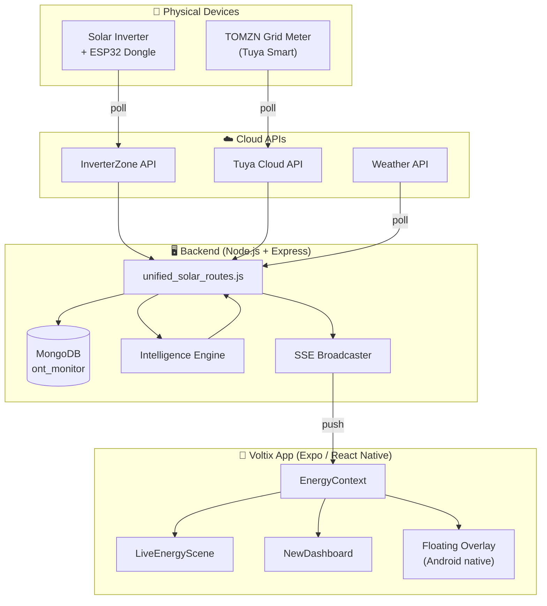
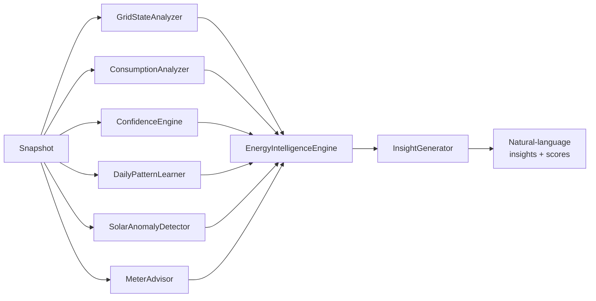

<div align="center">

<!-- Animated title banner -->


<!-- Typing SVG -->
<a href="https://github.com/your-username/voltix">
  
</a>

<!-- Badges -->
<p>
  
  
  
  
  
  
</p>

<p>
  
  
  
  
</p>

<br/>

> A real-time home energy intelligence platform that fuses solar inverter telemetry, grid-side smart meter data, and on-device machine learning into a single, glanceable dashboard — with a floating overlay, anomaly detection, and a meter advisor that tells you *which* meter to trust.

<br/>

<!-- Animated scroll-down indicator -->


</div>

---

## Table of Contents

- [Overview](#overview)
- [Features](#features)
- [Architecture](#architecture)
- [Intelligence Engine](#intelligence-engine)
- [Tech Stack](#tech-stack)
- [Project Structure](#project-structure)
- [Getting Started](#getting-started)
- [Build & Deploy](#build--deploy)
- [API Reference](#api-reference)
- [Polling & Realtime Strategy](#polling--realtime-strategy)
- [Offline Detection](#offline-detection)
- [License](#license)

---

## Overview

Voltix is a **personalized energy intelligence & meter advisor** built for homes with a hybrid solar setup — solar inverter, battery backup, and dual utility meters. It continuously polls a cloud-connected inverter and a Tuya smart meter, fuses the streams, runs them through an on-server intelligence engine, and surfaces everything through a fast React Native app with a live floating overlay.

The system was designed around one core principle:

> **TOMZN's cumulative kWh is the single source of truth.** Every positive delta is written once to an allocation ledger and assigned to the meter that was active at that moment. Manual meter readings reconcile the displayed physical-meter reading — they never override real usage.

<div align="center">

```
┌─────────────┐   cloud    ┌──────────────┐   SSE / HTTP   ┌──────────────┐
│  Inverter   │ ─────────▶ │   Backend    │ ◀────────────▶ │   Voltix     │
│  (ESP32 +   │            │  (Node.js +  │                │   App        │
│   InverterZ)│            │   MongoDB)   │                │ (Expo/RN)    │
└─────────────┘            └──────────────┘                └──────────────┘
                                  ▲                               │
                                  │                               │ floating
                           ┌──────┴──────┐                        ▼ overlay
                           │  TOMZN Grid │                 ┌──────────────┐
                           │  Smart Meter│                 │  Always-on   │
                           │  (Tuya API) │                 │  Mini HUD    │
                           └─────────────┘                 └──────────────┘
```

</div>

---

## Features

<div align="center">

| | Feature | What it does |
|---|---|---|
| ⚡ | **Live Energy Scene** | Animated hero showing real-time solar, grid, and home energy flow with Skia-rendered particles |
| 🔋 | **Battery & UPS Tracking** | Battery SOC, charge/discharge rate, UPS fallback status when the inverter goes dark |
| 📊 | **Dual Meter Allocation** | Attributes every kWh to the meter that was active — no double counting, no lost energy |
| 🧠 | **Intelligence Engine** | 7 specialized analyzers running on every snapshot (see below) |
| 🪙 | **Meter Advisor** | Scores each meter 0–100 on performance and recommends the best one to switch to |
| 📈 | **24h Flow History** | Smooth chart of solar / grid / battery / home flow over the last 24 hours |
| 🔔 | **Insights & Anomalies** | Natural-language insights: "Solar produced 18% less than your 7-day average today" |
| 🖥️ | **Floating Overlay** | Android system overlay with a mini HUD — see live solar/grid without opening the app |
| 📴 | **Offline Estimation** | When devices go offline, the app estimates usage from learned daily patterns |
| 🌤️ | **Weather-Aware Forecasts** | Pulls local weather to adjust solar production forecasts |
| 🔄 | **Delta Sync** | `dataVersion` tracking — backend returns `{changed:false}` when nothing changed (~550 bytes) |
| 🎨 | **Glassmorphism UI** | Blur, gradients, and Lottie animations throughout |

</div>

<details>
<summary><b>📸 Screenshots & Visuals</b></summary>

> _Add screenshots here:_
> - `assets/screenshots/dashboard.png` — main dashboard
> - `assets/screenshots/hero.png` — live energy scene
> - `assets/screenshots/overlay.png` — floating overlay
> - `assets/screenshots/meters.png` — meter advisor
> - `assets/screenshots/insights.png` — intelligence card

</details>

---

## Architecture

<div align="center">



</div>

### Data Flow Summary

1. **Backend polls** the InverterZone and Tuya cloud APIs on a presence-based cadence (3s when a client is watching, 30s when idle).
2. **Each snapshot** is fingerprinted, persisted to MongoDB (max once per minute), and run through the Intelligence Engine.
3. **SSE broadcast** pushes only when data actually changes — the hero section is push-driven, not polled.
4. **Frontend** keeps an SSE connection open (even when idle) and paints the hero on push events. Dashboard sync uses delta encoding via `dataVersion`.

---

## Intelligence Engine

Seven specialized analyzers run on every snapshot, producing insights, scores, and anomaly flags.

<div align="center">



</div>

| Module | Responsibility |
|---|---|
| `GridStateAnalyzer` | Classifies grid state (connected / down / standby) using TOMZN + inverter cross-check. Prioritizes TOMZN when inverter is offline. |
| `ConsumptionAnalyzer` | Tracks burn rate, bucket usage, and calibration ratio per meter. |
| `ConfidenceEngine` | Computes confidence scores for each data source based on freshness and consistency. |
| `DailyPatternLearner` | Learns your typical hourly consumption pattern for offline estimation. |
| `SolarAnomalyDetector` | Flags unusual solar production drops (e.g. panel shading, fault). |
| `MeterAdvisor` | Scores each meter 0–100 on 4 weighted factors: historical bucket usage, calibration ratio/burn rate, mode match, and calibration confidence. Recommends the best meter to switch to. |
| `InsightGenerator` | Converts raw scores into human-readable insights — only surfaces a meter suggestion when a switch is actually recommended. |

<details>
<summary><b>🪙 Meter Scoring Formula</b></summary>

Meter scoring is **purely performance-based** — quota is not a factor. Each meter is scored 0–100 across four weighted dimensions:

| Factor | Weight | What it measures |
|---|---|---|
| Historical bucket usage | 30% | How much of its allocated energy bucket the meter has consumed |
| Calibration ratio / burn rate | 30% | How fast the meter is burning through its allocation |
| Mode match | 20% | Whether the meter's mode matches the current grid/solar state |
| Calibration confidence | 20% | How confident we are in the meter's calibration data |

Final score = weighted sum. The MeterAdvisor recommends switching only when a non-active meter scores significantly higher than the active one.

</details>

---

## Tech Stack

<div align="center">

| Layer | Technology |
|---|---|
| **Mobile App** | Expo SDK 57, React Native 0.86, React 19, TypeScript 6 |
| **Navigation** | Expo Router (file-based routing) |
| **Animations** | Moti, React Native Reanimated 4, Lottie, React Native Skia |
| **Icons** | Lucide React Native, Expo Symbols |
| **Backend** | Node.js, Express |
| **Database** | MongoDB (local instance) |
| **Realtime** | Server-Sent Events (SSE) via `react-native-sse` |
| **Native Modules** | Kotlin (FloatingOverlayService, RefreshRateController) |
| **Cloud APIs** | InverterZone, Tuya, OpenWeather |
| **Process Manager** | PM2 |
| **Build** | Gradle (Android), EAS CLI |

</div>

---

## Project Structure

```
voltix/
├── src/
│   ├── app/                    # Expo Router file-based routes
│   │   ├── (tabs)/             # Tab screens: home, meters, history, logs, settings
│   │   ├── overlay-editor.tsx  # Floating overlay configuration
│   │   └── _layout.tsx         # Root layout — EnergyProvider, SceneThemeProvider
│   ├── components/             # UI components
│   │   ├── LiveEnergyScene.tsx # Animated hero (solar/grid/home flow)
│   │   ├── NewDashboard.tsx    # Scrollable dashboard shell
│   │   ├── NewDashboardCards.tsx
│   │   ├── EnergyIntelligenceCard.tsx
│   │   ├── NewMetersScreen.tsx
│   │   └── new-ui/skia-hero/   # Skia-rendered hero particles
│   ├── context/
│   │   ├── EnergyContext.tsx   # Main data context — polling, SSE, offline cache
│   │   ├── IdleContext.tsx     # App idle/foreground state
│   │   └── energy-types.ts     # Shared TypeScript types
│   ├── native/                 # Native module bridges
│   └── utils/
│       └── offline-dashboard.ts# Offline estimation logic
├── backend/
│   ├── backend_api.js          # Express server entry
│   ├── unified_solar_routes.js # Solar engine — TOMZN, inverter, meters, SSE
│   ├── tuya_routes.js          # Tuya device routes
│   └── intelligence/           # 7 analysis modules (see above)
├── android/                    # Native Android project (Kotlin modules)
├── assets/                     # Images, fonts, Lottie files
├── app.json                    # Expo config
└── package.json
```

---

## Getting Started

### Prerequisites

- Node.js 18+
- Android Studio (for emulator) or a physical Android device
- Expo CLI (`npm i -g expo-cli`)
- A running backend instance (Node.js + MongoDB)

### Install & Run

```bash
# 1. Clone the repo
git clone <repo-url> && cd voltix

# 2. Install dependencies
npm install

# 3. Start the Expo dev server
npx expo start

# 4. Open on device
#    - Press 'a' for Android emulator
#    - Or scan the QR with Expo Go on your phone
```

### Backend Setup

```bash
cd backend
npm install        # install backend deps
# Configure your MongoDB URI and cloud API credentials
# Start with PM2:
pm2 start backend_api.js --name backend_api
pm2 logs backend_api
```

> **Note:** Cloud API credentials (InverterZone device ID, Tuya keys, weather API key) are not included in the repo. Configure them via environment variables or a local config file.

---

## Build & Deploy

### Android APK (Release)

```bash
# Set JAVA_HOME
export JAVA_HOME=/usr/lib/jvm/java-17-openjdk-amd64

# Build the release APK
cd android && ./gradlew :app:assembleRelease

# Output:
# android/app/build/outputs/apk/release/app-release.apk

# Install on a connected device
adb install -r android/app/build/outputs/apk/release/app-release.apk
```

### Backend Deployment

The backend runs on a cloud VM behind PM2. To deploy changes:

```bash
# 1. Syntax check locally
cd backend && node -c <file>.js

# 2. Upload to server
scp <file>.js <user>@<server>:~/

# 3. Restart the backend
ssh <user>@<server> 'node -c ~/<file>.js && pm2 restart backend_api'
```

> Server connection details are kept private. See `AGENTS.md` (not committed) for internal deployment commands.

---

## API Reference

### Solar Engine

| Endpoint | Method | Purpose |
|---|---|---|
| `/api/solar/dashboard` | GET | Full dashboard (meters, energy, forecasts) |
| `/api/solar/live` | GET | Lightweight live data (~200 bytes) |
| `/api/solar/dashboard/sync` | GET | Delta sync — `?since=<dataVersion>` |
| `/api/solar/refresh` | POST | Force-refresh all sources |
| `/api/solar/refresh/tomzn` | POST | Force-refresh TOMZN only |
| `/api/solar/refresh/inverter` | POST | Force-refresh inverter only |
| `/api/solar/changeover` | POST | Switch active meter |
| `/api/solar/manual-readings` | POST | Submit manual meter reading |
| `/api/solar/manual-readings/:id` | PATCH | Edit manual reading |
| `/api/solar/manual-readings/:id` | DELETE | Delete manual reading |
| `/api/solar/baselines` | POST | Set meter baseline |
| `/api/solar/perf` | GET | Performance stats (60s rolling window) |
| `/api/solar/tomzn/history` | GET | TOMZN historical data |
| `/api/solar/flow-history` | GET | 24h flow history for chart |

---

## Polling & Realtime Strategy

<div align="center">

| Interval | Endpoint | Payload | Purpose |
|---|---|---|---|
| **Push** | SSE `/live/stream` | ~200 bytes | Hero section — only on data change |
| 30s | `/api/solar/dashboard/sync?since=N` | 551 B (no change) or ~50 KB (changed) | Full dashboard delta |
| 60s | `/api/solar/flow-history` | varies | Chart data |

</div>

- **Backend device poll is presence-based**: 3s while any app or overlay is connected, 30s when idle. Presence = SSE clients or any `/live` / `/dashboard/sync` hit in the last 45s.
- **Hero is push, not pull**: the backend only SSE-broadcasts when TOMZN / inverter / weather actually changes. No polling timer while the app is open.
- **Delta sync**: the backend increments `dataVersion` on every mutation. The frontend sends its version; the backend returns `{changed:false}` if it matches — saving ~50 KB per cycle.

---

## Offline Detection

Voltix uses a multi-layered approach to distinguish genuine offline from stale cloud data:

### TOMZN Grid Meter

1. **Fingerprinting** — each reading is fingerprinted (`energyKwh|powerW|voltageV|currentA`)
2. **Stale threshold** — 10 consecutive identical fingerprints → `isOnline: false`
3. **Tuya online state** — trusts Tuya's `online_state: false` directly
4. **DB seeding** — stale tracker is seeded from the database on restart, maintaining state across reboots
5. **Standby exemption** — when the user manually switches TOMZN off, identical zero readings are expected and the stale check is skipped

### Solar Inverter

1. **Cloud API poll** with fingerprinting
2. **Stale data detection** — if the fingerprint is identical to the last poll, perform a **direct TCP check** to the inverter's public IP:port
3. **TCP check fails** → inverter is genuinely offline → marked offline immediately (bypasses the 4-failure threshold)
4. **TCP check succeeds** → inverter is reachable, data just hasn't changed → stays online
5. **Grid state cross-check** — when the inverter is offline, `GridStateAnalyzer` prioritizes TOMZN data to determine WAPDA grid status (avoids false "grid down" reports)

> **Result:** Offline detection in ~7 seconds with accurate status even when the cloud API serves stale cached data.

---

<div align="center">

## License

This project is **private and proprietary**. All rights reserved.

<br/>


<sub>Built with ⚡ solar energy. Powered by intelligence.</sub>

</div>
